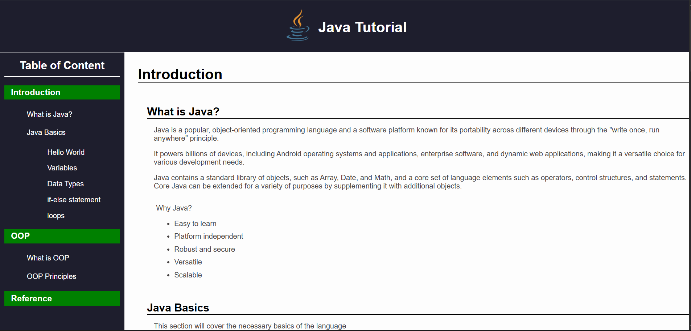

# Technical Documentation Page

A project built as part of the **FreeCodeCamp Responsive Web Design Certification**.  
This page is a simple technical documentation example built with HTML and CSS.

---

## Live Demo
[View on GitHub Pages](https://leawi-t.github.io/technical-documentation-page)

---

## Preview
 <!-- optional: add a screenshot of your project -->

---

## Features
- Responsive design (works on mobile, tablet, and desktop)
- Clean and simple layout
- Navigation bar with smooth scrolling
- Sections for easy documentation

---

## Built With
- HTML5
- CSS3

---

## Project Structure
technical-documentation-page/
├── index.html
├── styles.css
├── README.md
└── screenshot.png

## How to Use
1. Clone the repository  
   ```bash
   git clone https://github.com/YOUR-USERNAME/technical-documentation-page.git


